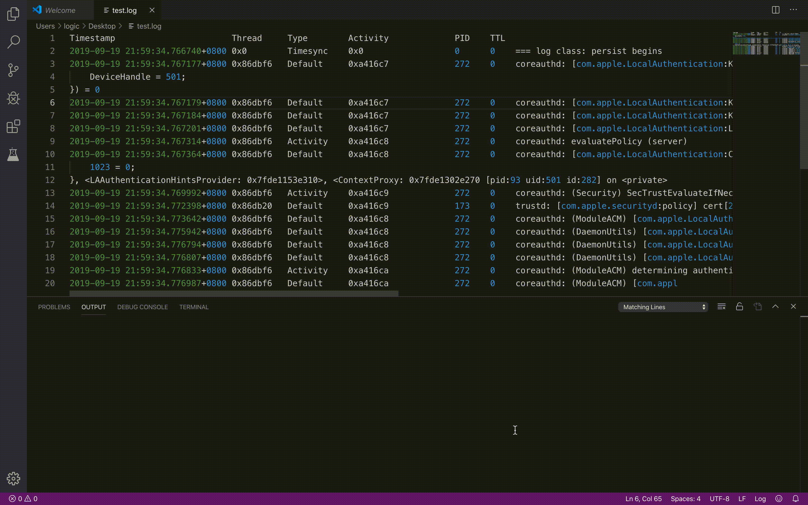

# Log Helper

The aim of the `Log Helper` is to make it easy to analyze log in vscode.

## Features

- Print matching lines

1. Open `Command Palette`.
2. Type `LogHelper:Print Matching Lines`.
3. Type a regular expression matching the lines you want to show.

- Delete matching lines

Coming soon.

- Print ASan information

Coming soon.

## Release Notes

### 0.0.1

Add feature `Print Matching Lines`.

### 0.0.2

Change the name.